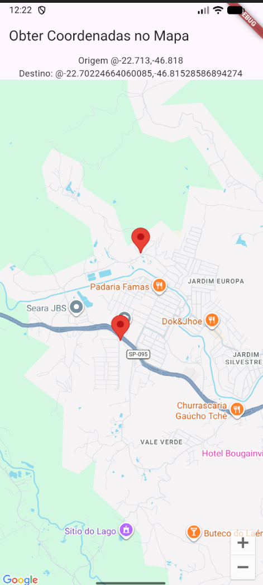

# Flutter Google Maps API OSRM

Aplicativo Flutter que exibe um mapa do Google Maps através do método http, para checagem de destino. Toque no mapa para ver as coordenadas do ponto selecionado e adicionar um marcador.

## Screenshot



## APK 

[Flutter Maps](/flutter_api_google_maps/assets/flutter_api_google_maps.apk)

## Como executar

Pré-requisito: 
- [Flutter instalado](https://docs.flutter.dev/get-started/install).
- Android Studio
- IDE (EX.: VsCode)
- Emulador ou dispositivo físico conectado

1. Clone o repositório:

   ```bash
   git clone https://github.com/EnzoToniato567/Flutter-API-Google-Maps.git
   ```

2. Acesse a pasta do app e instale as dependências:

   ```bash
   cd Flutter-Maps/flutter_maps
   flutter pub get
   ```

3. Inicie um dispositivo ou emulador e execute:

   ```bash
   flutter run
   ```
